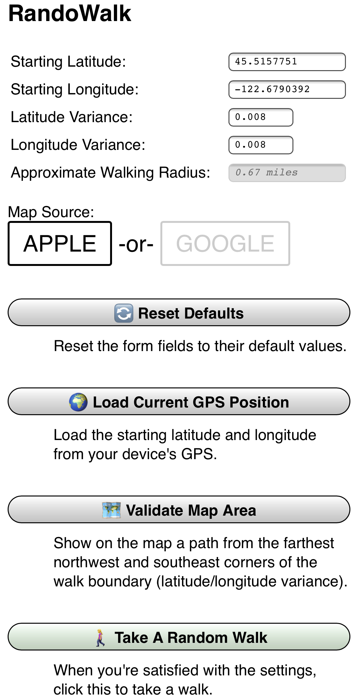
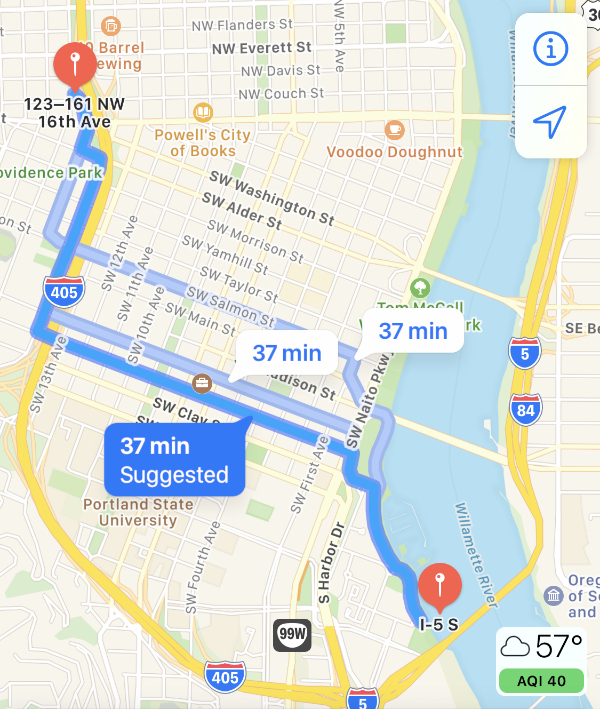
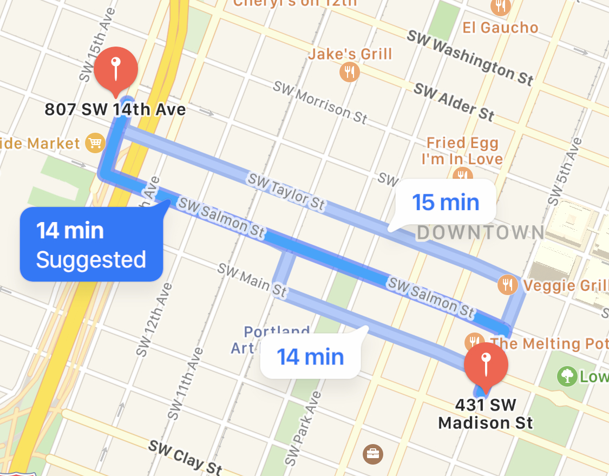
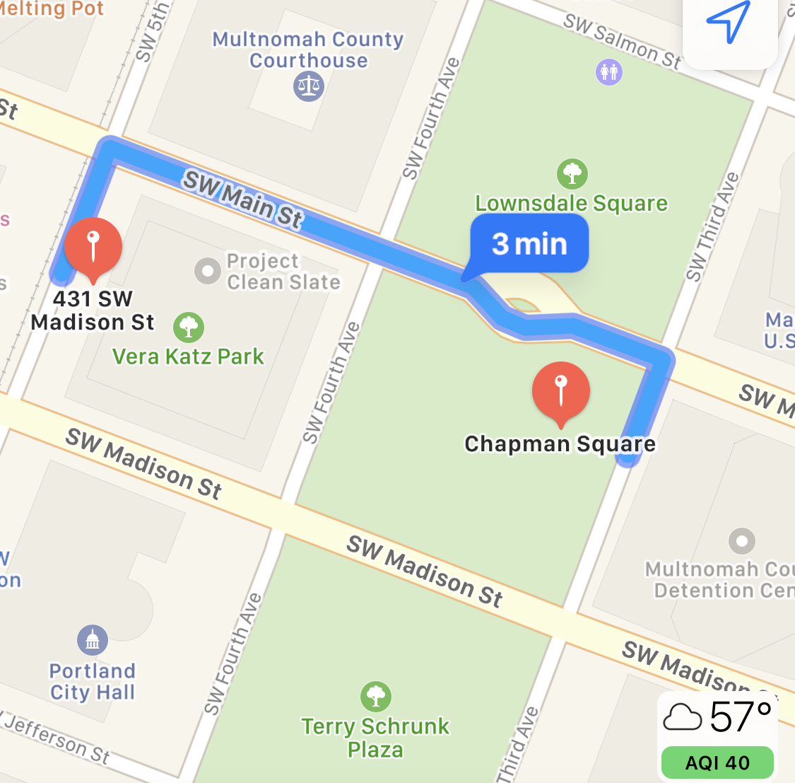
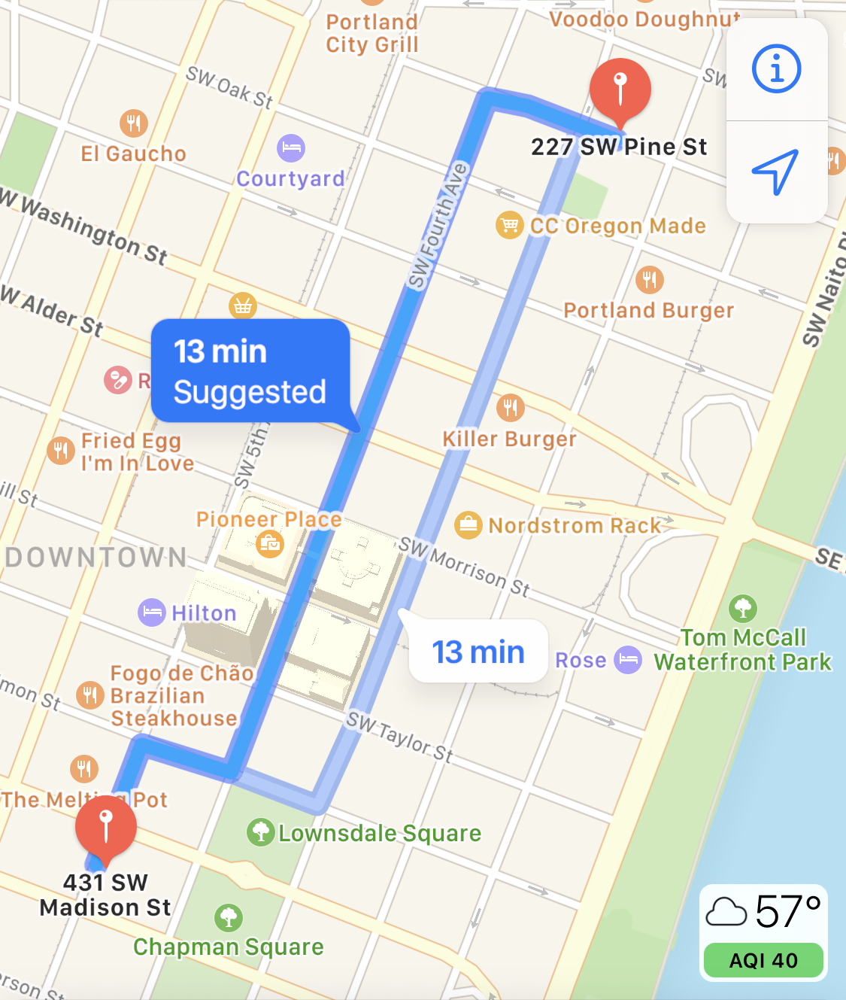

# RandoWalk

Recently the [Randonautica](https://www.randonautica.com) app has stopped working. This left me hanging since I would often use it for random walks around the neighborhood. There are other misleadingly-similarly-named apps out there that do the same thing. They mostly looked like predatory bottom-feeders, with hidden fees and subscriptions, which put me off. I figured it would be fairly simple to build out a basic web application that gave me a random point in the immediate vicinity. This is that webapp.

This version doesn't quite have the spooky woo-woo that goes with quantum attractors and voids and other pseudoscience. It uses regular random numbers — so take that as you will. I enjoy walking to new parts of the neighborhood and don't personally have a need for eerie quantum coincidences. If you want to put intention in your head before hitting the walk button, please do.

# Demo

You can see a demo at: <https://netninja.com/randowalk/>

- Hit “Load Current GPS Position” and grant browsers permissions.
- If you'd like to see the furthest distance possible to send you on a walk, hit “Validate Map Area.” This will draw a path from two opposing furthest corners.
- Hit the “Take a Random Walk” button to launch the map. Don't like your destination? You can always try again.
<table width="600">
<tr><td width="300"></td><td width="300"></td></tr>
<tr><td width="300">
    The main screen of the web application. This lets you set your starting point and (indirectly) your walk radius.
</td><td width="300">
    When you click on “Validate Map Area,” you'll see a sample map with waypoints in the far northwest and far southeast corners of where you might be sent on your walk. 
</td></tr>
</table>

## Sample Walks

When you hit the “Take a Random Walk” button, your mapping app will launch with your random walk. If you don't like it for any reason (too short, safety, etc), feel free to hit the button again. 

<table width="900">
<tr><td width="300"></td><td width="300"></td><td width="300"></td></tr>
<tr><td width="300">
    A decent little walk.
</td><td width="300">
    A very short walk to the center of Portland 2020 protests. Wear a gas mask after dark, or just reroll a new walk. 
</td><td width="300">
    A walk up near Voodoo Doughnuts. 
</td></tr>
</table>

# Installation

- Copy `settings-example.js` to `settings.js`
- Edit your default starting GPS location and variance.
- Put these files on a web server.

# Get Your GPS Location

⚠️ Privacy Note: Please be aware that any GPS coordinate you put into the `settings.js` file will be visible as the default location to anyone who loads up your instance of this webapp. If you put the GPS location of your home in settings, then put these files on a public server, there will be a strong possibility of a privacy violation. Your best bet is to either leave it as is (and use the GPS button when you want to begin) or to load in the GPS coordinates of a public landmark.

## The Easy Way: “Here”

- Use the “Load Current GPS Location” feature of the app.
- Copy and paste the latitude and longitude into the `settings.js` file.

## The Complicated Way: “Anywhere”

- Find your house (or other starting point) in a [Google Maps](https://maps.google.com) search. For example for the defaults, I did a search for the Portlandia sculpture in downtown Portland, Oregon.
- Copy out the URL. In this case: `https://www.google.com/maps/place/Portlandia/@45.5157751,-122.6812279,17z/data=!3m1!4b1!4m5!3m4!1s0x54950a101cb3456b:0x46db417e8d645c59!8m2!3d45.5157751!4d-122.6790392`
- There are obvious GPS coordinates at the front. In this case, `@45.5157751,-122.6812279`. You _*DO NOT*_ want those. There are less obvious ones at the end. In this case, the part that goes `d45.5157751!4d-122.6790392`. More specifically, if you trim out the extra letters and symbols (don't forget to retain the negative), you'll get `45.5157751,-122.6790392`
- Close your Google Maps browser tab and open a fresh one. Paste those coordinates into the location box to verify they are correct.
- Use those in your `settings.js` file.

# Finding a Default Variance

The latitude and longitude variance are used to determine range. We will pick a random number that is +/- that max variance value, then add (or subtract, if negative) to the latitude and longitude. This gives a bounding box that limits how far you'll walk. Up in Portland, this gives about a 0.6 mile radius. Because of the way latitude and longitude work, this radius may increase closer to the equator and shrink the further you move from it.

To get a rough idea of the radius, use the “Validate Map Area” button. This will show you the top-left and bottom-right corners of your possible destinations.

# TODO

- Remove variance values, replace with radius.
- Birdsite / FB / Slack preview meta.

# Third Party Libraries

This project makes use of the following third party libraries:

- [jQuery](https://jquery.com)
- [JavaScript Cookie](https://github.com/js-cookie/js-cookie)

# License

This work is licensed under a <a rel="license" href="http://creativecommons.org/licenses/by-nc-sa/4.0/">Creative Commons Attribution-NonCommercial-ShareAlike 4.0 International License</a>.
