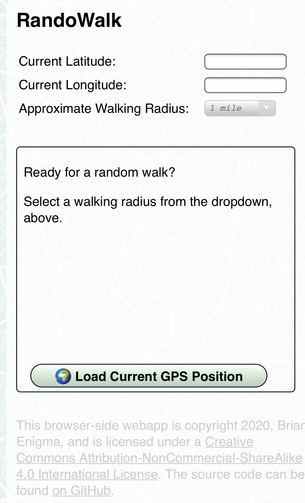
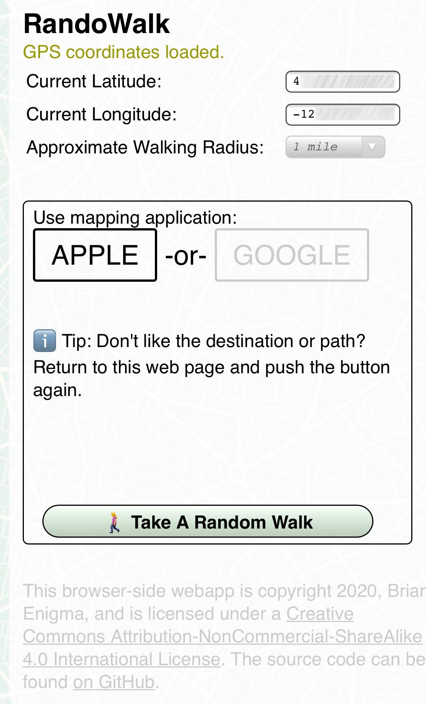

# RandoWalk

Recently the [Randonautica](https://www.randonautica.com) app has stopped working. This left me hanging since I would often use it for random walks around the neighborhood. There are other misleadingly-similarly-named apps out there that do the same thing. They mostly looked like predatory bottom-feeders, with hidden fees and subscriptions, which put me off. I figured it would be fairly simple to build out a basic web application that gave me a random point in the immediate vicinity. This is that webapp.

This version doesn't quite have the spooky woo-woo that goes with quantum attractors and voids and other pseudoscience. It uses regular random numbers — so take that as you will. I enjoy walking to new parts of the neighborhood and don't personally have a need for eerie quantum coincidences. If you want to put intention in your head before hitting the walk button, please do.

# Demo

You can see a demo at: <https://netninja.com/randowalk/>

- Hit “Load Current GPS Position” and grant browsers permissions.
- If you'd like to see the furthest distance possible to send you on a walk, hit “Validate Map Area.” This will draw a path from two opposing furthest corners.
- Hit the “Take a Random Walk” button to launch the map. Don't like your destination? You can always try again.
<table width="600">
<tr><td width="300"></td><td width="300"></td></tr>
<tr><td width="300">
    The first screen of the web application. This lets you set your walk radius.
</td><td width="300">
    The second screen, after your GPS coordinates are validated. Clicking the green button launches your preferred mapping app. 
</td></tr>
</table>

## Sample Walks

When you hit the “Take a Random Walk” button, your mapping app will launch with your random walk. If you don't like it for any reason (too short, safety, etc), feel free to hit the button again. 

<table width="900">
<tr><td width="300"></td><td width="300"></td><td width="300"></td></tr>
<tr><td width="300">
    A decent little walk.
</td><td width="300">
    A very short walk to the center of Portland 2020 protests. Wear a gas mask after dark, or just reroll a new walk. 
</td><td width="300">
    A walk up near Voodoo Doughnuts. 
</td></tr>
</table>

# Installation

- For others to enjoy: Put the index and javascript files, as well as the img folder, on a web server.
- For yourself: Open index.html in a web browser.

# Changelog

- Version 2
    - We now always query the browser for GPS coordinates and do not cache them in a cookie. If previous cookies exist with GPS coordinates, then forcibly delete them. Cookies get sent to the server and although we never store or look at them, I'd rather not have even the possibility of that kind of information disclosure. 
    - Changed from “variance” to “radius.”
    - Added stock photo [map background](https://www.istockphoto.com/vector/seamless-texture-city-map-in-retro-style-outline-map-gm1151367251-312017391?clarity=false).
    - Tips for your trips (just two at this point).
    - Card-based interface to simplify the flow.
    - Fix README file for new workflow.

# TODO

- Fix outermost container CSS for iPhone. It spans a little off the right edge of the screen.
- If user selected 1 mile, for example, don't do a random of [0..1]. Try to distribute it more toward the “1” end of the spectrum and less toward the zero. The user probably doesn't want to walk only 0.2 miles.
- Birdsite / FB / Slack preview meta.

# Third Party Libraries

This project makes use of the following third party libraries:

- [jQuery](https://jquery.com)
- [JavaScript Cookie](https://github.com/js-cookie/js-cookie)

# License

This work is licensed under a <a rel="license" href="http://creativecommons.org/licenses/by-nc-sa/4.0/">Creative Commons Attribution-NonCommercial-ShareAlike 4.0 International License</a>.
